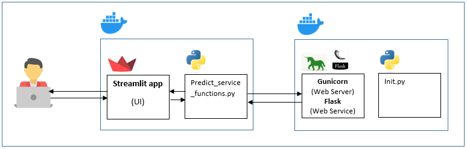
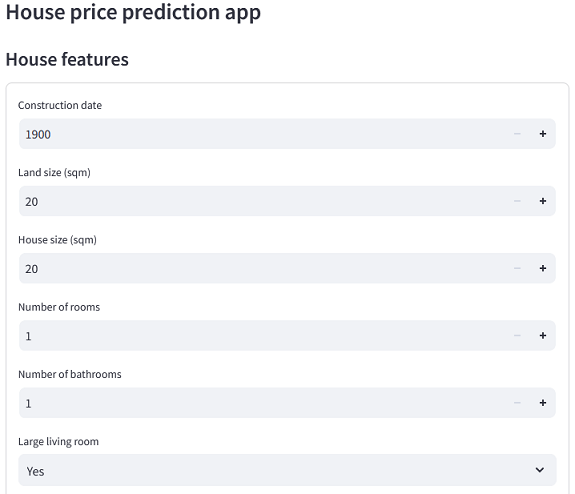
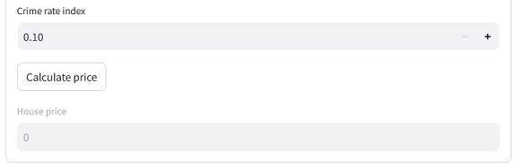

### Description
This is the midterm project for the DataTalks Club ML Zoomcamp 2024.

In this project we will build a web service that predicts house prices.

When we want to sell a house we visit a real estate site and provide all the house information we want to be available to a possible buyer. The problem arises when we want to find a suitable house price. What we usually do is we try to find other listed houses with similar features and their prices. Most of the times this is a very time consuming procedure.

So to help a house seller find a house price more easily we are going to build a web service. When the user fills in all the house features, those features will be send to the web service, which will actually be a model that will predict the house price and return it to the user.

This procedure will make the sellers experience easier and of course quicker.

### Dataset

We will use **Jiffs house price prediction** dataset from Kaggle. The dataset can be found in the URL below:

https://www.kaggle.com/datasets/elakiricoder/jiffs-house-price-prediction-dataset

but you don't need to download it. It can be found in the **data** folder as **data.csv**

### Tecnologies used

#### Jupyter notebook
  
Jupyter notebook is used run the **notebook.ipynb** file. We use this file for model evaluation and model selection. You will be able to see how each model was evaluated, evaluation graphs and also some metrics as RMSE.

#### Gunicorn
  
Gunicorn is s a Python WSGI (Web Server Gateway Interface) HTTP Server. The Flask application runs on this server.

### Flask
  
Flask is the framework which we use to create the prediction web service. 

#### Streamlit
  
Streamlit is used to create the user interface (UI). The user fills in the house features. Then he clicks on the **Calculate Price** button and the predicted house price is displayed.

#### Docker
  
We use docker to create the containers for our app. We actually have two containers. One which contains the user interface and the script that allows us to connect to the predict service, and one which is actually our predict service.

#### Scikit-learn
  
We use the **scikit-learn** python library to handle data splitting, model training, model evaluation and other things.

### Application flow

Below you can see the application flow diagram.  

  

The user opens a browser and accesses the house features form which is actually a streamlit app. When the user fills in the form with the desired values he/she clicks on the **Calculate price** button. The streamlit app uses a function from the **predict_service_functions.py** file to connect to the web service **(predict_service.py)**. The connection is made by using the **/predict_house_price** endpoint. The **predict** function uses the model **(model.bin)** to predict a house price. The price is then returned to the user and displayed in the appropriate form field. The **init.py** script runs when the application starts. You can read more about this script in the **Run the application** section.

### Application structure

The following folders/files are included in the application:

* **app** folder. This folder contains all the files needed for the application to run.
* **data** folder. The application data file is stored here.
* **docker-compose.yaml, Dockerfile.gunicorn** and **Dockerfile.streamlit** are used by docker to create the **UI** and **Predict Web Service** application containers.
* **requirements.streamlit.txt**. All python libraries with their versions, used by the UI container are stored here.
* **app.py**. This is the application entry point. It is the file that is loaded when the UI container starts.
* **predict_service_functions.py** This file contains the necessary functions to connect to the house price predict web service.
* **requirements.gunicorn.txt**. All python libraries with their versions, used by the predict service container are stored here.
* **init.py**. This file is used to perform data preparation and cleaning, to split the data into train and test datasets, to train and finally save the model.
* **predict_service.py** This is the house price prediction web service. This service receives all the house features and returns a predicted price for the house.
* **notebook.ipynb** This is a Jupyter notebook file which was used for model evaluation and model final selection. After the best model with its parameters is selected, this model is then used in the application.
* **README.md**. This file.

### Install Jupyter Notebook and Docker

#### Install Jupyter Notebook
To install Jupyter Notebook you can use the following link:

https://docs.jupyter.org/en/latest/install/notebook-classic.html

#### Install Docker and Docker Compose 
To install Docker and Docker Compose you can use the following links:

https://docs.docker.com/engine/install/  
https://docs.docker.com/compose/install/

### Run the application

#### Clone the github repository
Open a terminal, navigate to a folder where you want the repository files to be stored and then type:  

```console
git clone https://github.com/sgkertsos/predict-house-price.git
```
#### Start the application
Start the application by typing the following commands:

```console
cd app
docker compose up
```
Wait for the application to load. 

After the application loading is done we have two docker containers running simultaneously:

* Gunicorn on port 9696    
* Streamlit on port 8501

When the Gunicorn docker container starts for the first time, the **init.py** script runs. In this script the following happen:

* Data is loaded
* Data preparation is made
* Data is split into train and test data
* Test data is saved as **test.csv** in the **/app/data** folder so that you can have some examples to play with.
* A Random Forest Regressor model with specific parameters is trained. The specific model and the specific parameters were selected after model evaluation was performed by using the **notebook.ipynb** Jupyter Notebook file.
* The model is saved under the filename **model.bin**.

This model is then loaded by the house price predict web service to predict house prices. 

**Note**  
The script checks if the model file **(model.bin)** file exists. If the file exists, the script will not perform the initialiation process again.

### Access the user interface
Open your preferred browser and navigate to the following address:

http://localhost:8501

The application loads and you are presented with the house features form.

  
  
  

Fill in all the house features and the click on the **Calculate Price** button. The house price is displayed in the field below.

### Run notebook.ipynb Jupyter Notebook
If you want to check how the model evaluation was made, you can do it by opening the **notebook.ipynb** file in Jupyter Notebook and execute the code in each cell.

To start Jupyter Notebook type the following in your terminal:

```console
jupyter notebook
```
Copy the URL that is shown in your terminal and paste it in your preferred browser. The following picture appears. 

  

Double click on the **notebook.ipynb** file. The file is opened in a different tab. In this file we do the following:

* We load, clean the data and check for missing values.
* We perform Exploratory Data Analysis. 
* We setup a validation framework.
* We calculate feature importance.
* We train and evaluate three different models:
  * Linear Regression
  * Decision Tree  
    The model is evaluated for multiple **max_depth** values.  
  * Random Forest  
    The model is evaluated for multiple **max_depth** and **n_estimators** values.  
    
  RMSE is calculated for each model. The best RMSE is 0.065 for the Random Forest model.  

* We can fill in house features and use the Random Forest model to make a price prediction.  

Each notebook cell has a short description of what is actually done.

### Notes

#### Access streamlit container terminal
First you have to find the streamlit container id.

Type:

```console
docker ps
```
and note the streamlit container id, eg 68967bc26fc0

Copy the container id and then type:

```console
docker exec -it 68967bc26fc0 bash
```
You are now in the **/app** folder and you are ready to interact with the application files, eg take a look at the **test.csv** file mentioned earlier.


