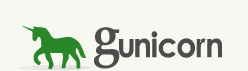

### Description
This is the midterm project for the DataTalks Club ML Zoomcamp 2024.

In this project we will build a web service that predicts house prices.

When we want to sell a house we visit a real estate site and provide all the house information we want to be available to a possible buyer. The problem arises when we want to find a suitable house price. What we usually do is we try to find other listed houses with similar characteristics and their prices. Most of the times this is a very time consuming procedure.

So to help a house seller find a house price more easily we are going to build a web service. When the user fills in all the house characteristics, those characteristics will be send to the web service which will actually be a model that will predict the house price and return it to the user.

This procedure will make the sellers experience easier and of course quicker.

### Dataset

We will use **Jiffs house price prediction** dataset from Kaggle. The dataset can be found in the URL below:

https://www.kaggle.com/datasets/elakiricoder/jiffs-house-price-prediction-dataset

but you don't need to download it. It can be found in the **data** folder as **data.csv**

### Tecnologies used

#### Gunicorn

Gunicorn is s a Python WSGI (Web Server Gateway Interface) HTTP Server. The Flask application runs on this server.

### Flask

Flask is the framework which we use to create the prediction web service. 

#### Streamlit
  
Streamlit is used to create the user interface (UI). The user fills in the house features. Then he clicks on the **Calculate Price** button and the predicted house price is displayed.

#### Docker
  
We use docker to create the containers for our app. We actually have two containers. One which contains the user interface and the script that allows us to connect to the predict service, and one which is actually our predict service.

#### Scikit-learn

We use the **scikit-learn** python library to handle data splitting, model training, model evaluation and other things.

